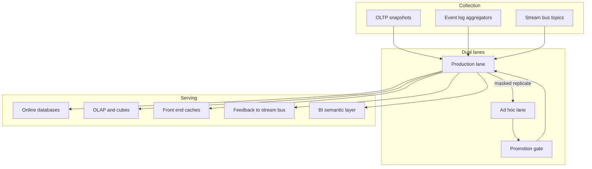

# Twinlane

**Source:** `ai-in-enterprise/Big Data Analytics Reference Architectures - Big Data on Facebook, LinkedIn and Twitter/`
**Domain:** `ai-enterprise`
**One-liner:** A dual-lane analytics platform control plane that separates strict-deadline production workloads from ad-hoc discovery — with stream ingest, ETL promotion gates, and serving paths patterned on how hyperscale consumer platforms actually run analytics.
**Wedge:** Enterprise data platform teams (fintech, marketplaces, large digital product orgs) drowning in a single shared Hadoop/Spark estate where ad-hoc queries steal capacity from SLA jobs and untested workloads reach production unchecked.
**Positioning:** Platform product management for big-data analytics estates. The source synthesises Facebook, LinkedIn, and Twitter reference architectures: production vs ad-hoc clusters, Kafka-centric activity streams, scheduled ETL with promotion from dev to prod, and distinct serving sinks. Twinlane productises that operating model so enterprises get hyperscale *discipline* without pretending to be Facebook.

## Market research synthesis

### Thesis from source

The document argues that big data forces a shift to data-centric architecture and operational models, and that organisations need shared semantic/architecture components comprising a Big Data Ecosystem. It contrasts classical extended-relational and non-relational reference architectures (noting components that still fail big-data challenges) and Hadoop-centric discovery architectures (strong on some challenges, weak on others such as search) with **concrete production patterns** from three consumer platforms.

**Facebook:** dual collection paths — federated MySQL user data and web-server event logs via Scribe into Hadoop/HDFS; compression and transfer into Production Hive–Hadoop; dual clusters where **strict-deadline jobs run in Production** and **lower-priority/ad-hoc jobs run in Ad hoc**, with replication Production→Ad hoc; results written back to Hive or MySQL; HiPal/Hive CLI for ad-hoc; Databee for periodic batch in Production; Microstrategy for dimensional BI.

**LinkedIn:** database snapshots plus **Kafka-collected streaming activity events** (producers→topics→brokers; consumers at own pace); Kafka→Hadoop ETL (combine, de-dupe)→copy into production and development clusters; **Azkaban** schedulers per environment; workloads as MapReduce/Pig/Hive/shell; experiment in development, **transfer to production after review/testing**; results to offline debug or online DBs and sometimes back to Kafka; **Avatara** prepares OLAP cubes into Voldemort read-only stores.

**Twitter:** real-time path with Blender brokering requests, FireHose ingestion, EarlyBird low-latency retrieval, search-assistance stats stores, ranking analysis persisted to HDFS, front-end cache serving users — a stream-processing topology distinct from batch Hive analytics. Commentary in-thread notes architectures should follow use case/value and that the market pivots toward real-time analytics.

The product wedge is the recurring operating principle across these references: **lane separation** (production SLA vs ad-hoc), **promotion discipline** (dev→prod after review), **stream + batch collection**, and **explicit serving sinks** — not a single congested cluster.

### Buyer & economic model

- **Primary buyer:** Head of Data Platform / Director of Analytics Infrastructure owning cluster cost and SLA attainment.
- **Users:** data platform PMs, batch/stream SRE, analytics engineers, data scientists (ad-hoc lane), data stewards, BI owners of serving datasets.
- **Budget owner / value metric:** platform TCO and **SLA attainment for deadline jobs**; secondary metric is safe promotion throughput (jobs graduated from ad-hoc/dev without incidents).
- **Competing status quo:** one shared cluster with yarn/queue chaos, Confluence “promotion checklists,” cron sprawl, and shadow Kafka topics without ownership.

### Domain constraints

- **Regulatory / trust / safety:** production serving datasets that influence user-facing or regulated decisions need lineage and approval; ad-hoc must not read forbidden stores.
- **Data sensitivity:** activity streams and user databases are highly sensitive; replication Production→Ad hoc must respect masking and access tiers.
- **Change-management realities:** data scientists will bypass gates if ad-hoc lane is unusable; production owners will block all change if promotion is informal; real-time and batch lanes need different operators but shared governance vocabulary.

## Business requirements

- BR-1: The platform must enforce at least two compute lanes — Production (strict deadline) and Ad hoc/Discovery — with hard isolation of capacity and separate failure domains.
- BR-2: Activity/event collection must support streaming ingest (Kafka-class) with topic ownership, retention, and consumer lag SLOs distinct from batch snapshot dumps.
- BR-3: No workload may run in Production without passing a promotion review from Development/Ad hoc with recorded test evidence.
- BR-4: Production schedulers must declare deadline class and alert before SLA breach; Ad hoc must be preemptible without impacting Production.
- BR-5: Replication from Production to Ad hoc must apply policy (full, masked, sampled) appropriate to data classification.
- BR-6: Serving sinks (online DB, OLAP/read-only store, feedback to stream bus, BI semantic layer) must be registered with owners and freshness SLAs.
- BR-7: Real-time retrieval/serving paths (Twitter-style low-latency) must be modellable as first-class chains separate from Hive batch, with their own latency budgets.
- BR-8: Lineage from source (MySQL snapshot, Scribe/Kafka event, FireHose-like stream) to serving dataset must be queryable for audit.
- BR-9: Cost showback must attribute spend by lane and by workload owner.
- BR-10: Exception path: emergency Production hotfix requires break-glass with time-boxed waiver and mandatory retrospective — not silent bypass.
- BR-11: Ad hoc interfaces (GUI and CLI class) must authenticate to the Ad hoc lane only by default.
- BR-12: Commercial constraint: new cluster capacity investment requires lane utilisation evidence — no funding of “more of the same shared pile.”

## User stories

Canonical user stories live in sibling [USER_STORIES.md](USER_STORIES.md).

## System design

### Overview

Twinlane is the control plane for a dual-lane analytics estate. It inventories sources (OLTP snapshots, event logs, streams), manages ingest connectors, enforces lane isolation and schedulers, runs promotion workflows, registers serving sinks (online, OLAP, cache, bus feedback), and exposes lineage and cost. Execution engines remain pluggable; Twinlane owns the operating model Facebook/LinkedIn/Twitter patterns imply.

### Actors & boundaries

- **Actors:** platform head, analytics engineers, data scientists, stream SREs, stewards, BI owners, break-glass approvers.
- **Trust boundary:** Ad hoc lane is hostile to Production isolation goals — access policies and masking sit at the boundary. Serving sinks that face applications are production-trusted; exploration outputs are not.
- **Human-in-the-loop points:** promotion reviews; break-glass waivers; replication policy exceptions; serving sink ownership transfer.

### Core capabilities

1. **Lane management** — Production vs Ad hoc isolation and capacity policy.
2. **Source and ingest registry** — snapshots, log aggregators, Kafka-class streams.
3. **Workload scheduling** — deadline classes and preemptible discovery jobs.
4. **Promotion gate** — dev/ad-hoc → production with evidence.
5. **Serving sink catalog** — online DB, OLAP, cache, bus feedback, BI.
6. **Real-time path registry** — low-latency retrieval chains distinct from batch.
7. **Lineage and classification** — source-to-sink audit graph.
8. **Cost showback** — lane and owner attribution.
9. **Break-glass governance** — emergency waivers and retrospectives.

### Conceptual data

- **Primary entities:** Lane, ClusterBinding, DataSource, IngestConnector, StreamTopic, Workload, SchedulePolicy, PromotionRequest, ServingSink, RealtimePath, LineageEdge, CostAllocation, BreakGlassWaiver, AccessPolicy, AuditEvent.
- **Critical events:** workload submitted, SLA risk raised, promotion approved/rejected, replication applied, sink published, break-glass opened/closed, cost snapshot posted.
- **Retention / audit needs:** promotion and break-glass records retained for platform audit; lineage retained across dataset versions.

### Integrations (conceptual)

- **Systems of record:** metastore/catalog, scheduler (Azkaban-class), Kafka (or equivalent), Hive/Spark/Presto engines, online KV/SQL stores, BI tools, identity/IAM.
- **Upstream signals:** queue metrics, consumer lag, job duration, cluster utilisation.
- **Downstream actions:** job kill/preempt, promotion tickets, sink ACL updates, cost chargeback exports.

### High-level architecture

### Success metrics

- **Leading:** Production deadline attainment; Ad hoc median queue time; % workloads with owners; promotion cycle time; consumer lag SLO compliance; break-glass count.
- **Lagging:** incident rate from untested prod jobs; % of serving datasets with lineage; cost per successful SLA job; reduction in cross-lane noisy-neighbor events.

## OpenAPI skeleton

Canonical HTTP surface lives in sibling [openapi.yaml](openapi.yaml). Summary:

- **Base path:** `/v1/...`
- **Auth:** `X-API-Key` for schedulers/engines; Bearer JWT for operators.
- **Resource groups:** Lanes, Sources, Workloads, Promotions, Sinks, Lineage, Governance.
