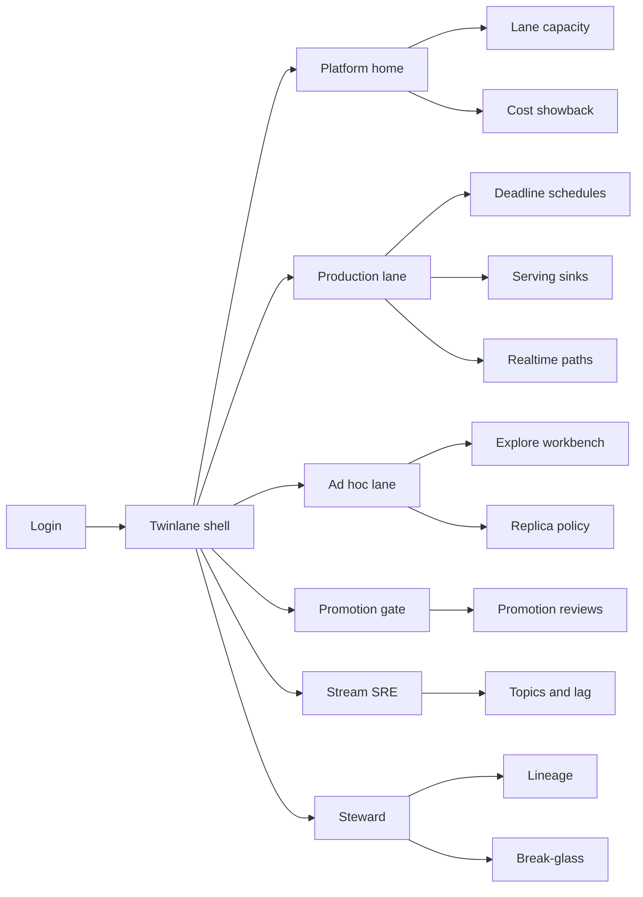
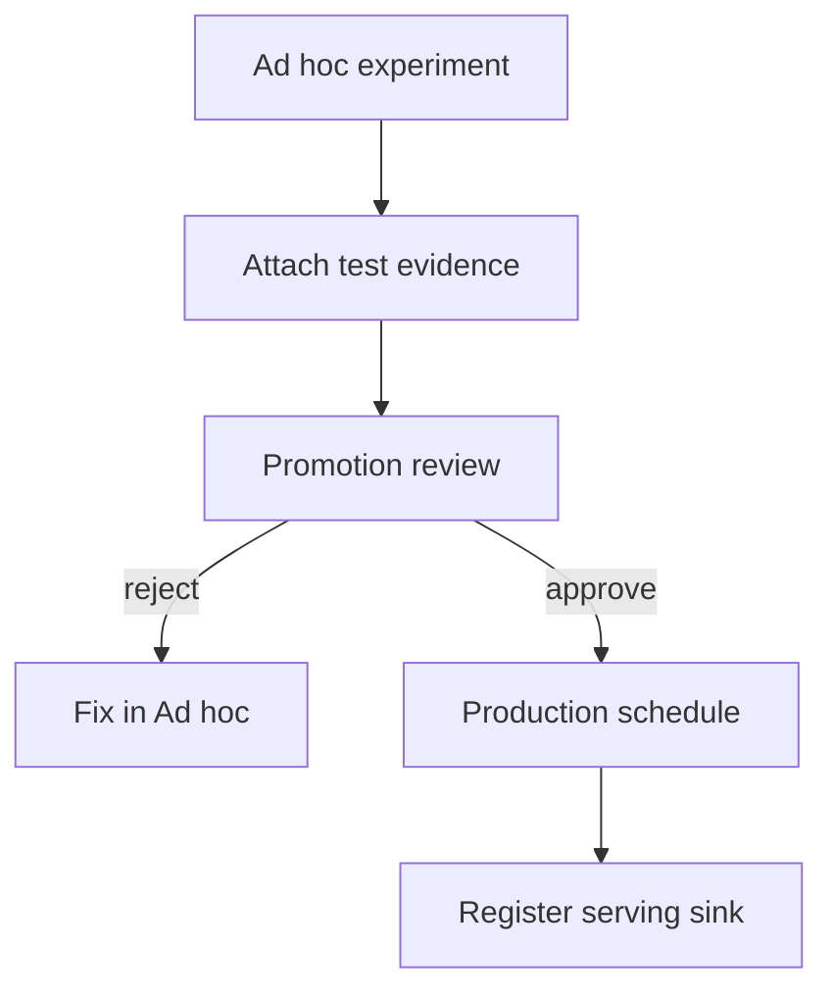

# Twinlane — Web app

**Product:** [PRODUCT.md](./PRODUCT.md)
**Primary surface:** Data platform control plane (Production vs Ad hoc lane operations)
**Secondary surfaces:** Promotion review desk; break-glass waiver console (time-boxed)
**Design thesis:** Twinlane is a dual-carriageway for analytics compute — the UI metaphor is two physically separated lanes (Production SLA vs Ad hoc discovery) with a toll booth (promotion gate) between them, patterned on Facebook/LinkedIn/Twitter operating discipline rather than a single congested cluster map. Visual language is asphalt-dark ground with lane-yellow for Production deadline risk and discovery-blue for Ad hoc; mint marks healthy SLA. The brand wordmark sits on every capacity and promotion screen so platform heads know isolation is the product, not “more Yarn queues on the same pile.”

## UX research synthesis

### Category peers (best-in-class)

- **Databricks Unity Catalog + Jobs UI:** Workspace separation, job promotion, and serving table ownership. Steal: promote-with-evidence and sink ownership; reject single-warehouse defaults that blur SLA vs exploratory spend.
- **Apache Airflow / Azkaban-style ops UIs:** Environment-scoped schedulers and DAG promotion. Steal: per-environment schedules with review records; reject cron sprawl without deadline class.
- **Confluent Control Center / LinkedIn Kafka patterns:** Topic ownership, consumer lag SLOs, feedback-topic governance. Steal: stream contracts distinct from batch snapshots; reject “Kafka exists” without owners.
- **Airbnb Dataportal / Lyft Amundsen-class catalogs:** Lineage from source to BI cube with stewards. Steal: queryable source→sink lineage; reject catalog-only UX that cannot preempt Ad hoc noisy neighbors.

### Patterns to adopt / reject

- **Adopt:** Hard lane chrome (never one mixed cluster home); promotion evidence required; Production→Ad hoc masking policy; serving sink freshness SLAs; cost showback by lane/owner; break-glass with retrospective; Ad hoc GUI/CLI scoped by default.
- **Reject:** Shared-queue “fair share” as isolation; Confluence checklist as the promotion system of record; purple lake marketing; capacity funding without utilisation evidence; scientists launching on Production by accident.

### Trust, density, and workflow constraints from PRODUCT.md

Ad hoc is hostile to Production isolation (BR-1, BR-11): default auth scopes discovery only. Replication must mask/sample by classification (BR-5). Serving datasets that influence user-facing decisions need lineage and owners (BR-6, BR-8). Emergency hotfixes are time-boxed waivers, not culture (BR-10). Density is SRE/platform-grade; data scientists get a fast Ad hoc workbench without Production controls clutter.

## Information architecture

### Nav model

### Roles → default home

| Role | Default home | Why |
|------|--------------|-----|
| Head of data platform | Platform home — SLA vs Ad hoc wait + cost | Dual-lane health (BR-1, BR-9) |
| Analytics engineer / batch owner | Production schedules + promotion | Deadline jobs (BR-3, BR-4) |
| Data scientist | Ad hoc explore workbench | Discovery without SLA theft (BR-11) |
| Stream platform SRE | Topics and consumer lag | Kafka-class contracts (BR-2) |
| Data steward / admin | Lineage + break-glass | Audit and emergencies (BR-8, BR-10) |
| BI / sink owner | Serving sink catalog | Freshness SLAs (BR-6) |

### Cross-links to OpenAPI resources

| Nav area | OpenAPI tags / resources |
|----------|---------------------------|
| Lane capacity, isolation | Lanes |
| Sources, ingest, topics | Sources |
| Schedules, workloads | Workloads |
| Promotion reviews | Promotions |
| Serving sinks, realtime paths | Sinks |
| Source-to-sink graph | Lineage |
| Break-glass, access, cost | Governance |

## Screen inventory

### Platform home

- **Purpose:** Answer “are SLA jobs protected while discovery still moves?” in one composition.
- **Entry:** Platform head post-login.
- **Layout regions:** Brand + estate switcher; dual-lane strip (Production deadline attainment, Ad hoc median wait, noisy-neighbor events, open break-glass); capacity utilisation by lane; promotion throughput; cost by lane.
- **Primary actions:** Open at-risk Production job; preempt Ad hoc; open promotion queue; deny capacity request lacking utilisation evidence.
- **Empty / loading / error:** Empty = bind first clusters to lanes; loading = dual skeleton meters; error = retry with request id.
- **BR / story ties:** BR-1, BR-9, BR-12.

### Lane capacity and isolation

- **Purpose:** Enforce Production vs Ad hoc failure domains and hard capacity splits.
- **Entry:** Platform → Lanes.
- **Layout regions:** Lane cards with cluster bindings; isolation policy; preemption rules; alert thresholds.
- **Primary actions:** Adjust policy; bind cluster; simulate noisy neighbor.
- **Empty / loading / error:** Single shared binding = coral “not dual-lane” banner.
- **BR / story ties:** BR-1, BR-4.

### Source and ingest registry

- **Purpose:** Inventory OLTP snapshots, log aggregators, and Kafka-class streams.
- **Entry:** Sources nav.
- **Layout regions:** Source table (type, owner, classification); connector health; batch vs stream tags.
- **Primary actions:** Register source; set classification; open lineage.
- **Empty / loading / error:** Unowned source = amber.
- **BR / story ties:** BR-2, BR-8.

### Stream topics and lag

- **Purpose:** Topic ownership, retention, consumer lag SLOs, feedback-topic governance.
- **Entry:** Stream SRE home.
- **Layout regions:** Topic list; lag SLO board; producer/consumer owners; Production write-back topics flagged.
- **Primary actions:** Set SLO; page on lag; approve feedback topic.
- **Empty / loading / error:** Orphan topic = cannot consume in governed mode.
- **BR / story ties:** BR-2.

### Production deadline schedules

- **Purpose:** Databee/Azkaban-class periodic batches with deadline class and pre-breach alerts.
- **Entry:** Production → Schedules.
- **Layout regions:** Schedule table; deadline class; SLA risk timeline; Ad hoc preemption log.
- **Primary actions:** Edit deadline; acknowledge risk; kill/preempt Ad hoc contenders.
- **Empty / loading / error:** No deadline class = cannot attach to Production.
- **BR / story ties:** BR-4.

### Ad hoc explore workbench

- **Purpose:** Performant discovery on masked replicas; GUI/CLI scoped to Ad hoc only.
- **Entry:** Data scientist default.
- **Layout regions:** Query/job composer bound to Ad hoc; replica freshness; mask notice; “request promotion” CTA.
- **Primary actions:** Run job; save experiment; request promotion.
- **Empty / loading / error:** Attempt Production submit = hard deny with explanation.
- **BR / story ties:** BR-5, BR-11; DS stories.

### Replication policy

- **Purpose:** Production→Ad hoc full/masked/sampled by classification.
- **Entry:** Steward; Ad hoc settings.
- **Layout regions:** Policy matrix; restricted-field denials; sample rates; last sync.
- **Primary actions:** Update policy; deny field; force resync.
- **Empty / loading / error:** Restricted field in Ad hoc = coral incident.
- **BR / story ties:** BR-5.

### Promotion review desk

- **Purpose:** Dev/Ad hoc → Production only with recorded test evidence.
- **Entry:** Promo nav; engineer CTA.
- **Layout regions:** Request queue; evidence pack (tests, owners, sink plan); approve/reject; audit id.
- **Primary actions:** Approve; reject; request more evidence.
- **Empty / loading / error:** Empty evidence = cannot approve.
- **BR / story ties:** BR-3.

### Serving sink catalog

- **Purpose:** Register online DB, OLAP/cube, cache, bus feedback, BI semantic layer with owners and freshness SLAs.
- **Entry:** Production → Sinks; BI owner.
- **Layout regions:** Sink table; freshness SLA; consumers; publish workflow.
- **Primary actions:** Register; transfer ownership; alert on stale.
- **Empty / loading / error:** Publish without owner = blocked.
- **BR / story ties:** BR-6.

### Real-time path registry

- **Purpose:** Model Twitter-style low-latency retrieval chains separate from Hive batch.
- **Entry:** Production → Realtime.
- **Layout regions:** Path graph (ingest → retrieval → cache); latency budget; distinct from batch lane chrome.
- **Primary actions:** Register path; set budget; link sinks.
- **Empty / loading / error:** Batch-only estate = optional empty with “add realtime path.”
- **BR / story ties:** BR-7.

### Lineage explorer

- **Purpose:** Query source (snapshot, Scribe/Kafka, FireHose-like) to serving dataset.
- **Entry:** Steward → Lineage; sink detail.
- **Layout regions:** Graph; classification badges; export for audit.
- **Primary actions:** Trace; export; open access policy.
- **Empty / loading / error:** Broken edge = amber gap.
- **BR / story ties:** BR-8.

### Cost showback

- **Purpose:** Attribute spend by lane and workload owner for capacity debates.
- **Entry:** Platform → Cost.
- **Layout regions:** Lane stacked cost; owner table; utilisation evidence for expansion requests.
- **Primary actions:** Export chargeback; attach to capacity RFC.
- **Empty / loading / error:** Missing metering = integration banner.
- **BR / story ties:** BR-9, BR-12.

### Break-glass waivers

- **Purpose:** Emergency Production hotfix with time box and mandatory retrospective.
- **Entry:** Admin; incident CTA.
- **Layout regions:** Active waivers countdown; scope; approver; retrospective checklist; close.
- **Primary actions:** Open waiver; extend with dual control; close with retro.
- **Empty / loading / error:** Expired open waiver = coral escalate.
- **BR / story ties:** BR-10.

## Key flows

1. **Discover then promote** — Ad hoc experiment → evidence → promotion review → Production schedule → sink publish; failure: reject without tests.

2. **Protect SLA** — deadline risk → preempt Ad hoc → alert owner → recover attainment.

3. **Stream lag response** — lag SLO breach → page SRE → scale/consumer fix → clear.

4. **Break-glass hotfix** — incident → time-boxed waiver → change → retrospective → close; failure: silent bypass impossible.

5. **Capacity funding** — request more nodes → show lane utilisation → approve/deny per BR-12.

## Design system

### Tokens (CSS variables)

- `--color-ink: #E8ECF0` — text
- `--color-asphalt-950: #0C0E12` — ground
- `--color-asphalt-900: #161A22` — panels
- `--color-asphalt-700: #2E3542` — rules
- `--color-lane-yellow: #E6C84A` — Production deadline risk
- `--color-discovery: #4C8DFF` — Ad hoc lane
- `--color-mint: #3DCF9A` — SLA healthy
- `--color-coral: #E85D4C` — isolation breach / expired waiver
- `--color-steel: #8B95A8` — secondary
- `--color-brand: #C5D0DE` — Twinlane wordmark (road steel)
- `--font-display: "IBM Plex Sans", sans-serif`
- `--font-mono: "IBM Plex Mono", monospace` — job ids, topic names
- `--space-1`…`--space-8`: 4px scale
- `--radius-sm: 4px`; `--radius-md: 8px`
- `--motion-preempt: 160ms ease-in` — Ad hoc kill flash
- `--motion-promote: 220ms ease-out` — toll-booth clear
- Atmosphere: dual vertical lane stripes (yellow/blue) faintly in asphalt-900; no purple lake nebula; no Facebook/LinkedIn brand mimicry.

### Typography & brand

- Display for SLA % and lane titles; mono for topics, job ids, waiver ids.
- Brand on capacity and promotion; login: “Two lanes. One promotion gate.”; one CTA.

### Do / don’t

- **Do:** Visually separate lanes always; require promotion evidence; mask Ad hoc replicas; showback cost; time-box break-glass.
- **Don’t:** One mixed cluster home; purple AI; editable promotion history; scientists on Production by default; fund capacity without utilisation.

### Accessibility & domain trust cues

- AA+ contrast; lane identity uses label + colour.
- Live regions for SLA risk and break-glass expiry.
- Focus: explore → promote → schedule → sink → lineage.
- Lineage export for audit replay.

## Component patterns

- **DualLaneMeter** — Production SLA vs Ad hoc wait side-by-side.
- **PromotionEvidencePack** — tests + owners + sink plan.
- **DeadlineClassBadge** — strict vs preemptible.
- **ReplicaMaskBanner** — classification policy on Ad hoc.
- **ServingSinkCard** — owner + freshness SLA.
- **TopicLagSLO** — consumer lag with owner.
- **BreakGlassCountdown** — time-boxed waiver.
- **LineageGraph** — source → serving edges.

## Out of scope for v1 web

- Replacing Spark/Hive/Flink engines; full notebook IDE; consumer social network features; multi-cloud marketplace; native mobile for SRE; automatic spend without finance systems of record.
